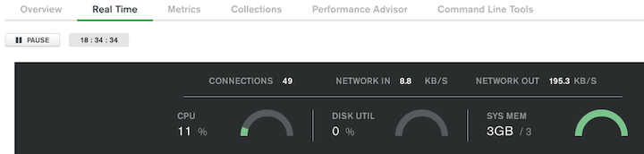

# Atlas Connection Analysis Tool

The MongoDB Atlas [Real-Time Performance Panel](https://docs.atlas.mongodb.com/real-time-performance-panel/) will show you how many connections are established:



Behind the scenes Atlas is running `db.currentOp(true).inprog.length` to get this number.

Some of these connections are established by the system, for example `watchdogMonitor`, while others, of course, are established by your client applications. This tool aims to provide more detail about the source of those connections by mapping the client address from the operation to the IP Access List entry you configured in Atlas. If you don't open your cluster to the world (0.0.0.0/0) and take care to document your IP Access List entries, this tool may provide some value.

To use the tool, you need to populate a [params.py](params.py) file with your credentials. As a prerequisite, you must have already [Configured Atlas API Access](https://docs.atlas.mongodb.com/configure-api-access/). The user provided in the connection string must have [Atlas admin](https://docs.atlas.mongodb.com/security-add-mongodb-users/#Atlas-admin) privileges, which are necessary to run the `db.currentOp(true)` command.
```
# Input parameters

# Atlas API
project_id = '<Project ID found under Atlas Project Settings>'
user = '<User Name>'
password = '<API Key>'

# Atlas DB
conn_string = '<Application connection string provided by the Atlas UI>'
database = 'analysis'
```
The `analysis` database is used to run some aggregation queries against the combined results. Feel free to name it whatever you like. 

Once the parameters are in place, running the tool will produce output like the following:

```
brianleonard$ python analyze_conn.py

MongoDB Atlas Connection Analysis Tool

There are 46 Access List entries
There are 208 current operations

Active Operations:22
Dormant Operations:186

            ==== Active Access List Operations (15) ====
 Connection Source                             Connections
 Azure Databricks Eastus2                              11
 Eastus2                                                2
 For MongoDB Stitch; do not delete                      1
 Brian Leonard's Home Office                            1

            ==== Active System Operations (7) ====
 Connection Source                             Connections
 NoopWriter                                             1
 watchdogCheck                                          1
 WT RecordStoreThread: local.oplog.rs                   1
 watchdogMonitor                                        1
 ReplBatcher                                            1
 monitoring keys for HMAC                               1
 rsSync                                                 1

            ==== Dormant Access List Operations (153) ====
 Connection Source                             Connections
 Azure Databricks Eastus2                              96
 Eastus2                                               28
 For MongoDB Stitch; do not delete                     19
 IP                                                     8
 Brian Leonard's Home Office                            2

            ==== Dormant System Operations (33) ====
 Connection Source                             Connections
 System                                                15
 initandlisten                                          1
 rsBackgroundSync                                       1
 replexec-54                                            1
 ftdc                                                   1
 replexec-57                                            1
 ApplyBatchFinalizerForJournal                          1
 replexec-56                                            1
 SyncSourceFeedback                                     1
 WTCheckpointThread                                     1
 WTJournalFlusher                                       1
 replexec-42                                            1
 replication-0                                          1
 WTOplogJournalThread                                   1
 LogicalSessionCacheReap                                1
 TTLMonitor                                             1
 clientcursormon                                        1
 SessionKiller                                          1
 LogicalSessionCacheRefresh                             1

Analysis Complete
```


